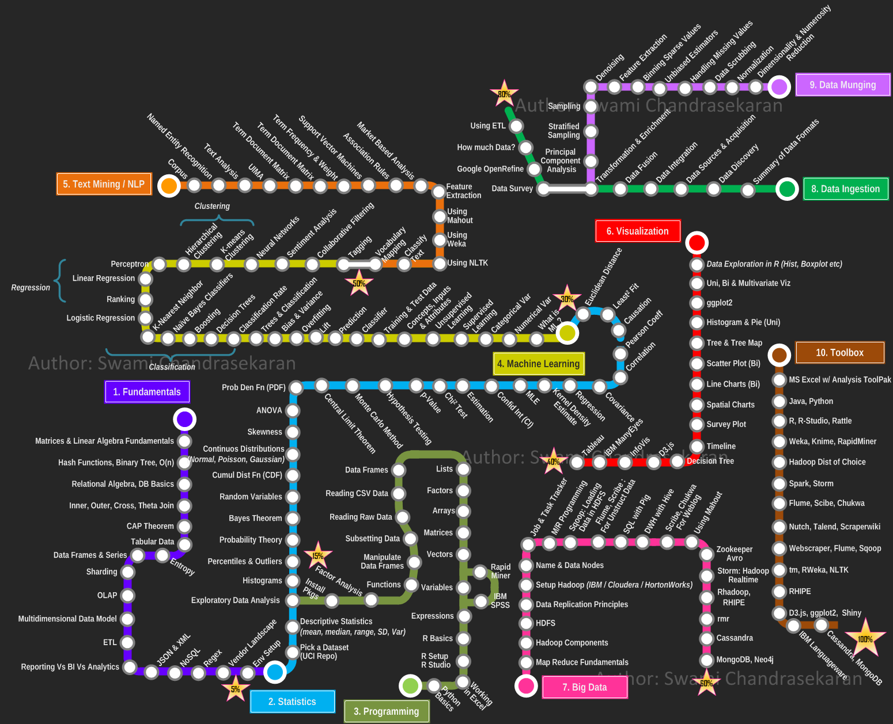

# Data Science Roadmap & Learning Journey

---

Привет! 👋 Это мой публичный репозиторий, где я документирую свой путь в изучении Data Science. Здесь хранятся мои конспекты, практические работы, проекты и заметки.

---

## 🗺️ Общая карта пути

---

## 📊 Roadmap Progress

Легенда статусов:
*  - Тема изучена
*  - В процессе изучения
*  - Еще не приступал

---

### 🧮 1. Fundamentals
*  _Matrices & Linear Algebra_
*  _Hash functions, Binary Tree, O(n)_
*  _Relation Algebra, DB basics_
*  _Inner, Outer, Cross, Theta Join_
*  _Cap Theorem_
*  _Tabular data_
*  _Enthropy_
*  *Data Frame & Series*
*  _Sharding_
*  _OLAP_
*  _Multidismentional Data Model_
*  _ETL_
*  _Reporting vs BI vs Analytics_
*  _JSON & XML_
*  _NoSQL_
*  _Regex_
*  _Vendor Landscape_
*  _Env Setup_

### 📈 2. Statistics
*  _Pick a Dataset_
*  _Descriptive Statistics_
*  _Exploratory Data Analysis_
*  _Histogram_
*  _Precentiles & Outliers_
*  _Probability Theory_
*  _Bayes Theorem_
*  _Random Variables_
*  _Cumul Dist Fn (CDF)_
*  _Continuos Distributions_
*  _Skewness_
*  _ANOVA_
*  _Prob Den Fn (PDF)_
*  _Central Limit Theorem_
*  _Monte Carlo Method_
*  _Hypotesis Testing_
*  _p-Value_
*  _Chi$^2$ Test_
*  _Estimation_
*  _Confid Int (CI)_
*  _MLE_
*  _Kernel Density Estimate_
*  _Regression_
*  _Couariance_
*  _Correlation_
*  _Pearson Coeff_
*  _Causation_
*  _Least$^2$ Fit_
*  _Euclidean Distance_

### 🐍 3. Programming
*  _Python Basics_
*  _Working in Excel_
*  _R setup, R studio_
*  _R basics_
*  _Expressions_
*  _Variables (IBM SPSS Rapid Miner)_
*  _Vectors_
*  _Matrices_
*  _Arrays_
*  _Factors_
*  _Lists_
*  _Data Frames_
*  _CSV_
*  _Reading Raw Data_
*  _Subsetting Data_
*  _Factor Analysis_

### 🤖 4. Machine Learning
*  _What is ML?_
*  _Numerical Var_
*  _Categorial Var_
*  _Supervised Learning_
*  _Unsupervised Learning_
*  _Concepts, Inputs & Attributes_
*  _Training & Test Data_
*  _Classifier_
*  _Predictions_
*  _Lift_
*  _Overfitting_
*  _Bias & Variance_
*  _Trees & Classifications_
*  _Classification Rate_
*  _Decision Trees_
*  _Boosting_
*  _Naive Bayes Classifiers_
*  _K-nearest Neighbour_
*  _Logistic Regression_
*  _Ranking_
*  _Linear Regression_
*  _Perceptron_
*  _Hierarchical Clustering_
*  _K-means Clustering_
*  _Neural Networks_
*  _Sentiment Analysis_
*  _Collaborative Filtering_
*  _Tagging_

### 📝 5. Text Mining / NLP
*  Vocabulary mapping
*  Classify Text
*  Using NLTK
*  Using Weka
*  Using Mahout
*  Feature Extraction
*  Market Based Analysis
*  Association Rules
*  Support Vector Machines
*  Term Frequency & Weight
*  Term Document Matrix
*  UIMA
*  Text analysis
*  Named Entity Recognition
*  Corpus

### 📊 6. Visualisation
*  Data Exploration in R (Hist, Boxplot etc)
*  Uni, Bi & Multivariate Viz
*  ggplot2
*  Histogram & Pie (Uni)
*  Tree & Tree map
*  Scatter plot (Bi)
*  Line Charts (Bi)
*  Spatial Charts
*  Survey plots
*  Timeline
*  Decision Tree
*  D3.js
*  InfoVis
*  IBM ManyEyes
*  Tableau

### 🐘 7. Big Data
*  MongoDB, Neo4j
*  Cassandra
*  rmr
*  Rhadoop, RHIPE
*  Storm: Hadoop Realtime
*  Zookeeper Avro
*  Using Mahout
*  Scribe, Chukwa for Weblog
*  DWH with Hive
*  SQL with Pig
*  Flume, Scribe: For Unstruct Data
*  Sqoop: Loading data in HDFS
*  M/R Programming
*  Job & Task Tracker
*  Name & Data Nodes
*  Setup Hadoop (IBM/Cloudera/Horton Works)
*  Data Replication Principles
*  HDFS
*  Hadoop Components
*  Map Reduce Fundamentals

### 📥 8. Data Ingestion
*  Summary of data formats
*  Data Discovery
*  Data sources & Acquisition
*  Data Integration
*  Data Fusion
*  Transformation & Enrichment
*  Data Survey
*  Google open Refine
*  How much Data?
*  Using ETL

### 🧹 9. Data Munging
*  Dimensionality & Numerosity Reduction
*  Normalisation
*  Data Scrubbing
*  Handling Missing Values
*  Unbiased Estimators
*  Binning Sparse Values
*  Feature Extractions
*  Denoising
*  Sampling
*  Stratified Sampling
*  Principal Component Analysis

---
<!--
## 🗂️ My Projects

Здесь будут появляться ссылки на мои учебные и pet-проекты.

* Проект 1: *Скоро будет...*
* Проект 2: *Скоро будет...*

---
-->

<!--
## 📈 Progress Overview

**Общий прогресс: 2 / 166 тем завершено!**

-->

